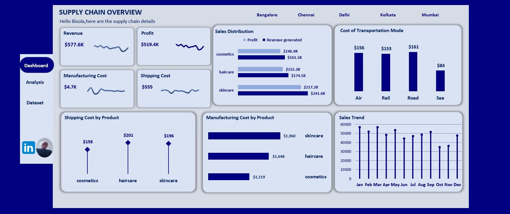
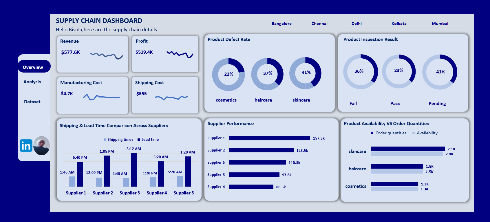

<!--Section 1: Introduce your self-->
## ABOUT ME

Hello! I'm Bisola Jongbo 🤓, a data analyst with a passion for turning data into actionable insights. 

<!--Mention your top/relevant skills here - core and soft skills-->
## SKILLS
Data Cleaning & Preparation,
Exploratory Data Analysis (EDA),
Data Modeling,
Data Wrangling
**TOOLS*
Excel.(Formulas,pivotTable,charts and Power query),
SQL.(querying, joins, aggregation),
PoweBi.(interactive dashboards and reports)

<!--Section 2: List 3-4 key projects-->
## MY PROJECTS

**Supply Chain Performance Dashboard.**

This project is about evaluating and optimizing supply chain performance which contains two page analyzed and visualized using Excel

**Problem Solved**
1. High defect rates and quality control issues –:Monitored defect percentages across product
categories.
2. Inventory stock imbalance : Highlighted gaps between product availability and order quantities.
3. Supplier performance optimization:Identified best and underperforming suppliers.
4. Cost control – Tracked manufacturing and shipping costs to manage profitability.
5. Transport mode efficiency:Compared transportation modes for strategic planning.
   
 **Key Findings*
1.  Total revenue: $577.6K | Profit: $519.4K with strong profit margin.
2.  2. Skincare leads in revenue ($241.6K) and profit ($217.2K) but has highest defect rate (41%).
3. Haircare: Moderate revenue ($174.5K) but high defect rate (37%).
4. Cosmetics: Lowest defect rate (22%) and manufacturing cost but lowest revenue.
5. Road ($161) and Air ($156) most used transportation modes; Sea least used ($84).
6. Supplier 1 has highest performance (157.5K) with good lead/shipping times.
7.  Minor inventory shortage in skincare (2.1K orders vs 2.0K available).
8.  ales peak in March and May; lowest in October.

[Read more]
([https://www.linkedin.com/posts/jongbobisolatolutope_supplychain-dashboard-dataanalysis-activity-7359797664919515136-EJvH?utm_source=share&utm_medium=member_desktop&rcm=ACoAADCfSSEBkJYYx6LxrwBKKNDqI_FiANTlAf8])

**Predictive Modeling and Hypothesis Testing using Titanic Dataset.**

On April 15, 1912, during her maiden voyage, the widely considered “unsinkable” RMS Titanic sank after colliding with an iceberg. 

[Read More](https://www.linkedin.com/pulse/predictive-modeling-hypothesis-testing-using-titanic-dataset-anietie/)

**Predictive Modeling and Hypothesis Testing using Titanic Dataset.**

Unfortunately, there weren’t enough lifeboats for everyone onboard, resulting in the death of 1502 out of 2224 passengers and crew. 

<a href="17 How to Present Data to Executives by Anietie Etuk.pdf">Download the Report here (pdf file)</a>

## CONTACT DETAILS

*Let’s connect and see how we can make a difference together!*
<table>
  <tbody>
    <tr>
      <td>📧</td>
      <td><a href="mailto:bisolajongbo@gmail.com">bisolajongbo@gmail.com</a></td>
    </tr>
    <tr>
      <td>📞</td>
      <td>(234) 8065954250</td>
    </tr>
    <tr>
      <td>📍</td>
      <td>IBDAN, Nigeria</td>
    </tr>
    <tr>
      <td>⬇️</td>
      <td><a href="https://bisolajongbo.github.io/portfolio1/docs/Profile.pdf">Download my CV</a></td>
    </tr>
    <tr>
      <td>🌐</td>
      <td><a href="https://linkedin.com/in/bisola tolutope Jongbo">The things I do daily on LinkedIn</a></td>
    </tr>
    <tr>
      <td>📺</td>
      <td><a href="https://www.youtube.com/@BisolaFranktheAnalyst">Watch my tutorials on YouTube</a></td>
    </tr>
  </tbody>
</table>

   

