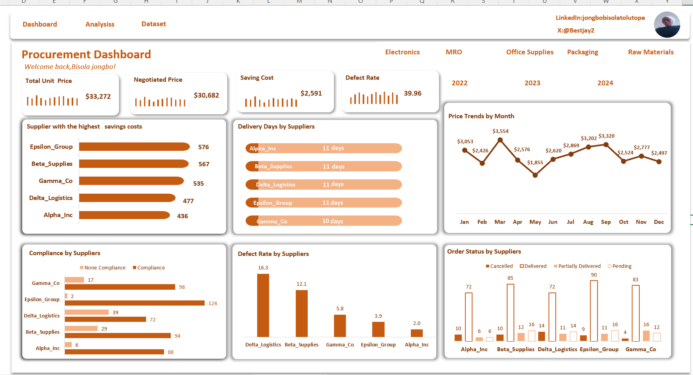

<!--Section 1: Introduce your self-->
## ABOUT ME

Hello! I'm Bisola Jongbo 🤓, a data analyst with a passion of turning data into actionable insights. 

<!--Mention your top/relevant skills here - core and soft skills-->
## SKILLS
Data Cleaning & Preparation,
Exploratory Data Analysis (EDA),
Data Modeling,
Data Wrangling

**TOOLS**
1. Excel.(Formulas,pivotTable,charts and Power query),
2. SQL.(querying, joins, aggregation),
3. Python(Modelling)
4. PoweBi.(interactive dashboards and reports)

<!--Section 2: List 3-4 key projects-->
## MY PROJECTS

**Supply Chain Performance Dashboard.**

This project is about evaluating and optimizing supply chain performance which contains two page analyzed and visualized using Excel

**Problem Solved**
1. High defect rates and quality control issues:Monitored defect percentages across product categories.
2. Inventory stock imbalance : Highlighted gaps between product availability and order quantities.
3. Supplier performance optimization:Identified best and underperforming suppliers.
4. Cost control – Tracked manufacturing and shipping costs to manage profitability.
5. Transport mode efficiency:Compared transportation modes for strategic planning.
   
**Key Insights**

1. Total revenue:$577.6K
2.  Profit: $519.4K with strong profit margin
3. Skincare: leads in revenue ($241.6K) and profit ($217.2K) but has highest defect rate (41%).
4. Haircare: Moderate revenue ($174.5K) but high defect rate (37%).
5. Cosmetics: Lowest defect rate (22%) and manufacturing cost but lowest revenue.
6. Road ($161) and Air ($156) most used transportation modes; Sea least used ($84).
7. Supplier 1 has highest performance (157.5K) with good lead/shipping times.
8. Minor inventory shortage in skincare (2.1K orders vs 2.0K available).
9. Sales peak in March and May; lowest in October.

[Read More](https://www.linkedin.com/posts/jongbobisolatolutope_supplychain-dashboard-dataanalysis-activity-7359797664919515136-EJvH?utm_source=share&utm_medium=member_desktop&rcm=ACoAADCfSSEBkJYYx6LxrwBKKNDqI_FiANTlAf8)

**Procurement Dashboard Analysis**

This analysis focused on procurement performance, evaluating supplier efficiency, cost savings, compliance, delivery timelines, defect rates, and price fluctuations over time. The goal was to uncover insights that help businesses reduce procurement costs, select reliable suppliers, and optimize purchasing decisions.
The dashboard was analyzed and built using Microsoft Excel, leveraging pivot tables, charts, and advanced formatting to create an interactive and insightful report for decision makers.

**Problem Solved**

The dashboard tackled issues of rising procurement costs, supplier inefficiencies, compliance gaps, product defects, and fluctuating price trends, providing a single view for data-driven decision-making.

**key Insights**
1.  Negotiations reduced procurement costs by $2,591, showing effective cost control.
2.  Epsilon_Group and Beta_Supplies contributed the highest savings.
3.  Delivery timelines were stable at 10–11 days across suppliers.
4. Delta_Logistics had the highest defect rate (16.3), while Alpha_Inc showed the best quality performance (2.0).
5.  Strong compliance was observed with Epsilon_Group (124 vs 2 non-compliance).
6.  Price volatility was uncovered, with costs peaking in March ($3,554) and dropping to the lowest in May ($1,855).

   [Read More]( https://www.linkedin.com/posts/jongbobisolatolutope_dataanalytics-businessintelligence-procurementanalytics-activity-7366088268561494017-yzFJ?utm_source=share&utm_medium=member_desktop&rcm=ACoAADCfSSEBkJYYx6LxrwBKKNDqI_FiANTlAf8
)
**Insurance Claim**

This project is focused on to building a predictive model to determine if a building will have an insurance claim during a certain period or not. I will have to predict the probability of having at least one claim over the insured period of the building. The model will be based on the building characteristics. The target variable, Claim, is a:
1 if the building has at least a claim over the insured period. 0 if the building doesn’t have a claim over the insured period..
This is built using Python, leveraging Data cleanings,EDA,Featuring Engineering,Visulazation Fixing inbalance,modelling and Evaluation.
  
## CONTACT DETAILS

*Let’s connect and see how we can make a difference together!*
<table>
  <tbody>
    <tr>
      <td>📧</td>
      <td><a href="mailto:bisolajongbo@gmail.com">bisolajongbo@gmail.com</a></td>
    </tr>
    <tr>
      <td>📞</td>
      <td>(234) 8065954250</td>
    </tr>
    <tr>
      <td>📍</td>
      <td>IBDAN, Nigeria</td>
    </tr>
    <tr>
      <td>⬇️</td>
     <td><a href="Jongbo Bisola Tolutope.pdf">Download my CV</a></td>
    </tr>
    <tr>
      <td>🌐</td>
      <td><a href="https://linkedin.com/in/bisola tolutope Jongbo">The things I do daily on LinkedIn</a></td>
    </tr>
    <tr>
      <td>📺</td>
      <td><a href="https://www.youtube.com/@BisolaFranktheAnalyst">Watch my tutorials on YouTube</a></td>
    </tr>
  </tbody>
</table>

   

